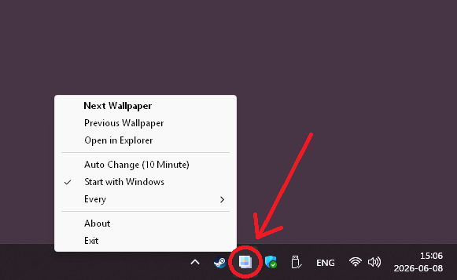

# Simple-Wallpaper-Changer

  

**Simple-Wallpaper-Changer** is a lightweight, efficient tool designed to randomize your Windows desktop wallpaper with ease. It solves the common problem where Windows chooses different wallpapers for each monitor when using folder-based slideshows, ensuring a consistent and unified background across all displays.

## 🌟 Features

- **Random Wallpaper Selection**: Choose from a vast collection of wallpapers stored in local directories
- **Auto Change Functionality**: Automatically rotate wallpapers at user-defined intervals (seconds, minutes, hours, or days)
- **History Management**: Keeps track of previously selected wallpapers to avoid repetition
- **Previous/Next Navigation**: Easily navigate between recently used wallpapers
- **Startup Integration**: Option to launch automatically with Windows startup
- **System Tray Interface**: Minimalist desktop application that runs in the system tray
- **Multi-Monitor Support**: Ensures same wallpaper on all monitors for a consistent look

## 📁 Folder Structure

The application organizes wallpapers into categorized subdirectories:
- `simpledesktops.com/` - Wallpapers from SimpleDesktops website
- `Solids/` - Solid color backgrounds (with sample colors)
- `wallhaven.cc/` - Wallpapers from Wallhaven platform  
- `XXX/` - Adult content category

## ⚙️ Technical Details

- Built with Python using pystray for system tray integration
- Leverages Windows API calls to change desktop wallpapers
- Stores settings and history in local files
- Implements single-instance checking to prevent multiple instances
- Cross-platform compatibility (Windows-specific implementation)

## 🎯 Key Benefits

- **Lightweight**: Minimal resource usage, optimized performance
- **Customizable**: Adjustable auto-change intervals with various time units
- **User-friendly**: Intuitive interface with context menu controls
- **Reliable**: Stable operation with proper error handling
- **Private**: All wallpapers stored locally, no internet connection required

## 🖼️ Screenshots

  

## 🔧 Installation & Usage

1. Ensure Python is installed on your system
2. Install dependencies: `pip install -r requirements.txt`
3. Run the application using: `python main.py` or execute the compiled binary
4. Access via system tray icon for all controls

## 📝 Notes

- The application will automatically generate sample solid color wallpapers if the Solids directory is missing
- History tracks previously selected wallpapers to prevent repetition
- Supports common image formats (JPG, PNG, BMP)